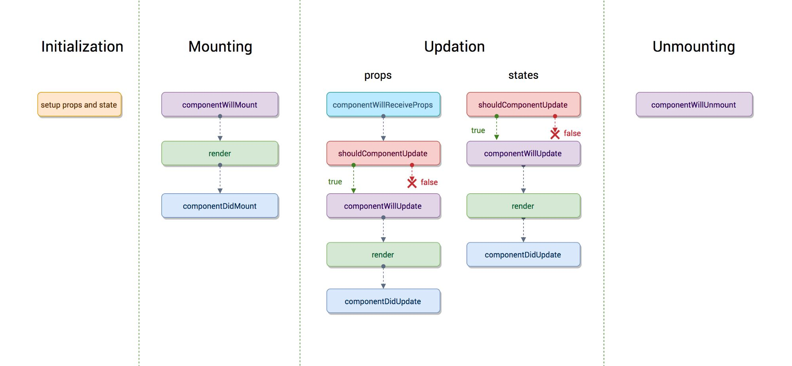
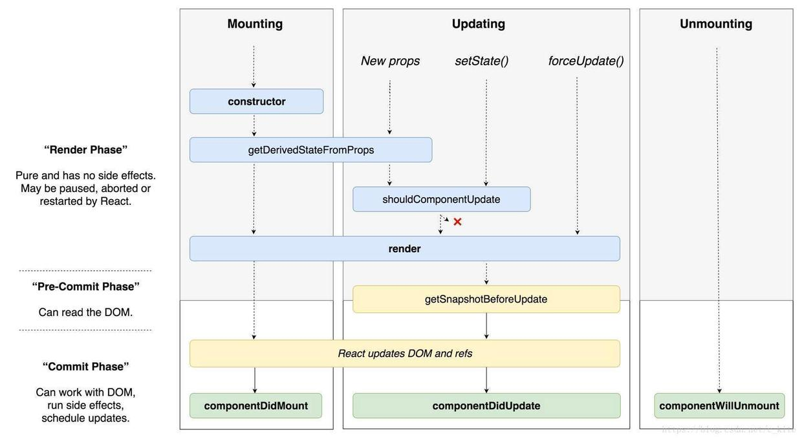

## 函数式编程
C/Java等都是命令式编程，而声明式编程更符合人类的逻辑思考，本质是一种lambda演算。

## JSX
使用类xml来描述虚拟DOM结构的模板语法。可以使用在javascript代码中，会在静态编译后转换为实际的js代码，因为叫JSX。

虚拟DOM一般使用JSON对象来描述，而JSX又直观的描述了此JSON对象。
``` js
// JSX
<div title={'this is title'}>
  <span>{'hello'}</span>
</div>

// 静态编译后的js代码
React.createElement(
  'div',
  {
    title: 'this is title'
  },
  React.createElement(
    'span',
    null,
    'hello'
  )
  // 还有children的话，依次注入
)

// 虚拟DOM的JSON对象
{
  type: 'div',
  props: {
    // 一些参数
    title: 'this is title',
    children: [
      {
        type: 'span',
        props: {
          children: 'hello'
        }
      }
    ]
  }
}

// 真实DOM
<div title="this is title">
  <span>hello</span>
</div>
```

### 纯函数与class组件
- 纯函数组件相当于调用方法直接返回虚拟DOM。
- class组件则会生成一个实例对象，this/ReactDOM.render()返回值等都是指这个实例，它拥有自己的生命周期，以及一些逻辑方法，想要得到虚拟DOM时，就调用render()方法。
- 纯函数组件没有实例，也就是ReactDOM.render一个纯函数组件会返回null。对一个纯函数组件使用ref时，只会得到undefined。 

### 语法小点
- 标签中可以使用多行注释
``` js
<div
  /*
    多行注释
  */
  title="hello" />
```
- 对于一些不支持的内容，比如渲染[if IE]条件注释代码，可以使用dangerouslySetInnerHTML。
- 渲染DOCTYPE标签，使用字符串拼接方法。
  - jsx里的所有标签都必须是闭合的，例如img/input等在html中自闭合的标签，在jsx中必须闭合！
- 两个特殊的属性。
  - class -> className
  - for -> htmlFor
- 对于html标签，不在范围内的属性，jsx虽然会编译到对象中，但react是不会渲染的。
- ???转移字符（书上为防止xss不会显示，实测会显示）。
- 模板语法{}，不会渲染boolean值以及对象数据。

## state
setState是一个异步操作，一个生命周期的所有设置会合并到一个操作。
## props
props数据流必须遵从自顶向下的单向数据流，且子组件不能修改父组件props。

props中默认带有children属性值。

## 生命周期
### 旧版

- `componentWillMount`，在该方法中setState不会发生重新渲染。
- `componentDidMount`，???在 componentDidMount() 里直接调用 setState()。它将触发额外渲染，但此渲染会发生在浏览器更新屏幕之前。
- `shouldComponentUpdate`，无状态组件没有此方法，因此无状态组件作为子组件时每次都会重新渲染，可使用Recompose库的pure方法。
``` js
const OptimizedComponent = pure(ExpensiveComponent)
```
### 新版（v16.3）



## HOOK
### useState
???React 会确保 setState 函数的标识是稳定的，并且不会在组件重新渲染时发生变化。这就是为什么可以安全地从 useEffect 或 useCallback 的依赖列表中省略 setState。

函数式更新时`对象`数据不会自动合并，需要手动操作。
``` javascript
const [state, setState] = useState({});
setState(prevState => {
  // 也可以使用 Object.assign
  return {...prevState, ...updatedValues};
});
```

???需要注意的是，React 可能仍需要在跳过渲染前渲染该组件。不过由于 React 不会对组件树的“深层”节点进行不必要的渲染，所以大可不必担心。如果你在渲染期间执行了高开销的计算，则可以使用 useMemo 来进行优化。
#### 函数式更新
指定state如何改变（侧重于方式），而不是引用当前的state。

### useEffect
useEffect Hook相当于是componentDidMount、componentDidUpate、componentWillUnmount三个生命周期的组合。

**useEffect每次重新渲染都会执行，包括清除函数。**

useEffect不会阻塞主进程，如果需要测量布局，可以使用 useLayoutEffect 。

## Fiber
React16之前diff算法是通过递归来实现，这次摒弃掉了递归，采用了Fiber模型来实现。

浏览器每一帧需要做的事情：


### requestIdleCallback
react自行实现了此方法。
``` js
// 计算出当前帧 结束时间点
var deadlineTime;

// 保存任务
var callback;

// 建立通信
var channel = new MessageChannel();

var port1 = channel.port1;

var port2 = channel.port2;

// 接收并执行宏任务
port2.onmessage = () => {
  // 判断当前帧是否还有空闲，即返回的是剩下的时间
  const timeRemaining = () => deadlineTime - performance.now();

  const _timeRemain = timeRemaining();

  // 有空闲时间 且 有回调任务
  if (_timeRemain > 0 && callback) {
    const deadline = {
      timeRemaining, // 计算剩余时间
      didTimeout: _timeRemain < 0, // 当前帧是否完成
    };

    // 执行回调
    callback(deadline);
  }
};

window.requestIdleCallback = function (cb) {
  requestAnimationFrame((rafTime) => {
    // 结束时间点 = 开始时间点 + 一帧用时16.667ms
    deadlineTime = rafTime + 16.667;

    // 保存任务
    callback = cb;

    // 发送个宏任务
    port1.postMessage(null);
  });
};

```

### requestHostCallback
``` js
let scheduledHostCallback = null;

let isMessageLoopRunning = false;

const channel = new MessageChannel();

// port2 发送
const port = channel.port2;

// port1 接收
channel.port1.onmessage = performWorkUntilDeadline;

const performWorkUntilDeadline = () => {
  // 有执行任务
  if (scheduledHostCallback !== null) {
    const currentTime = getCurrentTime();

    // Yield after `yieldInterval` ms, regardless of where we are in the vsync
    // cycle. This means there's always time remaining at the beginning of
    // the message event.
    // 计算一帧的过期时间点
    deadline = currentTime + yieldInterval;

    const hasTimeRemaining = true;

    try {
      // 执行完该回调后, 判断后续是否还有其他任务
      const hasMoreWork = scheduledHostCallback(
        hasTimeRemaining,

        currentTime
      );

      if (!hasMoreWork) {
        isMessageLoopRunning = false;

        scheduledHostCallback = null;
      } else {
        // If there's more work, schedule the next message event at the end
        // of the preceding one.
        // 还有其他任务, 推进进入下一个宏任务队列中

        port.postMessage(null);
      }
    } catch (error) {
      // If a scheduler task throws, exit the current browser task so the
      // error can be observed.
      port.postMessage(null);

      throw error;
    }
  } else {
    isMessageLoopRunning = false;
  }

  // Yielding to the browser will give it a chance to paint, so we can
  // reset this.

  needsPaint = false;
};

// requestHostCallback 一帧中执行任务
requestHostCallback = function (callback) {
  // 回调注册
  scheduledHostCallback = callback;

  if (!isMessageLoopRunning) {
    isMessageLoopRunning = true;

    // 进入宏任务队列
    port.postMessage(null);
  }
};

cancelHostCallback = function () {
  scheduledHostCallback = null;
};

```

- workInProgress tree代表了当前正在执行更新的Fiber树，currentFiber tree代表上次构建渲染的树，每一次更新完成，workInProgree就会复制给currentFiber。
- 该算法把整个diff过程分成了若干小任务，在浏览器空闲时间才会去做（这里用到了requestIdleCallback回调里的IdleDeadline参数的timeRemaining方法是否小于1进行判断当前是否还有剩余时间）。
- 小任务通过链表结构互相关联。
- 由于分散过程中会产生若干任务，每个任务拥有优先级。
- 小任务的执行过程，即创建、更新、挂起、恢复以及终止操作都是发生在workInProgress tree的创建过程中，这个构建过程就是循环的执行任务和创建下一个任务。过程简写代码如下。
``` javascript
let nextUnitWork = null;//下一个执行单元
//开始调度
function shceduler(task){
     nextUnitWork = task; 
}
//循环执行工作
function workLoop(deadline){
  let shouldYield = false;//是否要让出时间片交出控制权
  while(nextUnitWork && !shouldYield){
    nextUnitWork = performUnitWork(nextUnitWork)
    shouldYield = deadline.timeRemaining()<1 // 没有时间了，检出控制权给浏览器
  }
  if(!nextUnitWork) {
    conosle.log("所有任务完成")
    //commitRoot() //提交更新视图
  }
  // 如果还有任务，但是交出控制权后,请求下次调度
  requestIdleCallback(workLoop,{timeout:5000}) 
}
/*
 * 处理一个小任务，其实就是一个 Fiber 节点，如果还有任务就返回下一个需要处理的任务，没有就代表整个
 */
function performUnitWork(currentFiber){
  //beginWork(currentFiber) //找到儿子，并通过链表的方式挂到currentFiber上，每一偶儿子就找后面那个兄弟
  //有儿子就返回儿子
  if(currentFiber.child){
    return currentFiber.child;
  } 
  //如果没有儿子，则找弟弟
  while(currentFiber){//一直往上找
    //completeUnitWork(currentFiber);//将自己的副作用挂到父节点去
    if(currentFiber.sibling){
      return currentFiber.sibling
    }
    currentFiber = currentFiber.return;
  }
}
```

-  一个小任务的大概构成。
``` javascript
class FiberNode {
  constructor(tag, pendingProps, key, mode) {
    // 实例属性
    this.tag = tag; // 标记不同组件类型，如函数组件、类组件、文本、原生组件...
    this.key = key; // react 元素上的 key 就是 jsx 上写的那个 key ，也就是最终 ReactElement 上的
    this.elementType = null; // createElement的第一个参数，ReactElement 上的 type
    this.type = null; // 表示fiber的真实类型 ，elementType 基本一样，在使用了懒加载之类的功能时可能会不一样
    this.stateNode = null; // 实例对象，比如 class 组件 new 完后就挂载在这个属性上面，如果是RootFiber，那么它上面挂的是 FiberRoot,如果是原生节点就是 dom 对象
    // fiber
    this.return = null; // 父节点，指向上一个 fiber
    this.child = null; // 子节点，指向自身下面的第一个 fiber
    this.sibling = null; // 兄弟组件, 指向一个兄弟节点
    this.index = 0; //  一般如果没有兄弟节点的话是0 当某个父节点下的子节点是数组类型的时候会给每个子节点一个 index，index 和 key 要一起做 diff
    this.ref = null; // reactElement 上的 ref 属性
    this.pendingProps = pendingProps; // 新的 props
    this.memoizedProps = null; // 旧的 props
    this.updateQueue = null; // fiber 上的更新队列执行一次 setState 就会往这个属性上挂一个新的更新, 每条更新最终会形成一个链表结构，最后做批量更新
    this.memoizedState = null; // 对应  memoizedProps，上次渲染的 state，相当于当前的 state，理解成 prev 和 next 的关系
    this.mode = mode; // 表示当前组件下的子组件的渲染方式
    // effects
    this.effectTag = NoEffect; // 表示当前 fiber 要进行何种更新
    this.nextEffect = null; // 指向下个需要更新的fiber
    this.firstEffect = null; // 指向所有子节点里，需要更新的 fiber 里的第一个
    this.lastEffect = null; // 指向所有子节点中需要更新的 fiber 的最后一个
    this.expirationTime = NoWork; // 过期时间，代表任务在未来的哪个时间点应该被完成
    this.childExpirationTime = NoWork; // child 过期时间
    this.alternate = null; // current 树和 workInprogress 树之间的相互引用
  }
}
```

???副作用到底是什么
